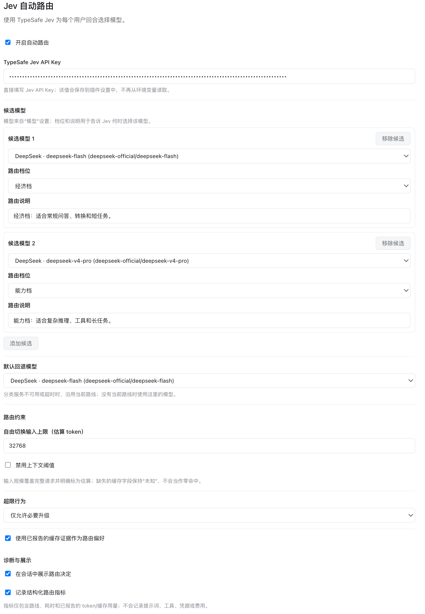
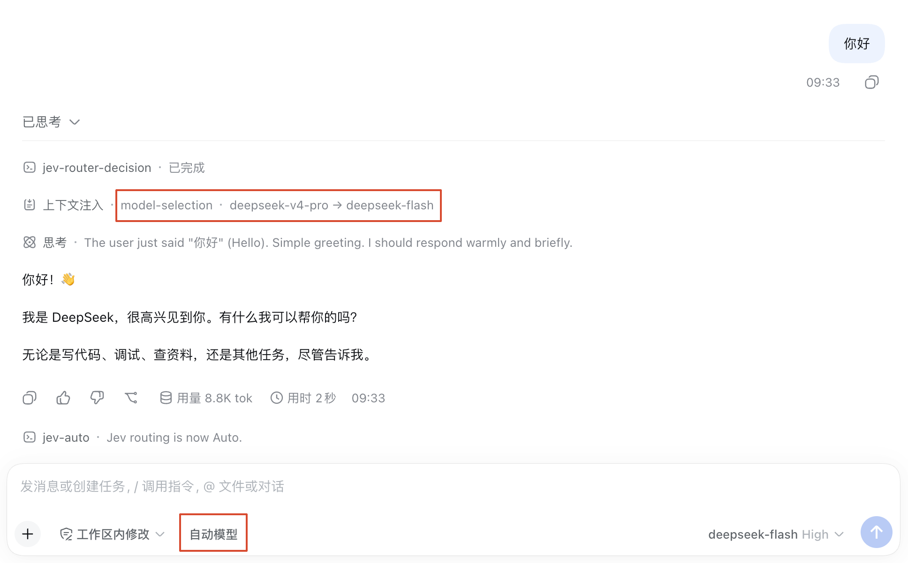

# dsh Jev Router

`@asi-ai/dsh-jev-router` 是一个面向 [DeepSeek Harness (dsh)](https://github.com/deepseek-ai/deepseek-harness) 的按回合模型路由插件。它使用 TypeSafe Jev 分析当前用户请求，在已配置的候选模型中选择更合适的执行路线，例如为日常任务使用经济档模型，为复杂推理、工具调用或长任务使用能力档模型。

插件不会替换 dsh 的会话历史或执行循环：Jev 只接收用于分类的有限材料，实际执行模型仍接收 dsh 的完整会话上下文。

## 主要功能

- 按每个用户回合自动选择候选模型，支持经济档与能力档。
- 支持 `Auto` 和 `Fixed` 两种会话模式。`Fixed` 模式保持当前模型，`Auto` 模式交由 Jev 选择。
- 同一用户回合中的工具续步和请求重试沿用已经确定的模型，不会重复分类或中途切换。
- 提供上下文规模阈值、超限策略、切换后的保持回合数和缓存感知等路由约束。
- 可在目标模型支持时一起路由思考档位。
- 可在会话中展示建议模型、实际模型、路由原因、分类耗时以及 token/cache 用量；也可以记录不含原文的结构化指标。
- 分类服务不可用、超时、缺少 API Key 或返回无效选择时，自动回退到当前路线或默认模型。

## 安装

插件发布在 npm：[@asi-ai/dsh-jev-router](https://www.npmjs.com/package/@asi-ai/dsh-jev-router)。在需要使用插件的 dsh Web profile 中执行：

```sh
pnpm dsh plugin --profile web add @asi-ai/dsh-jev-router
```

安装完成后重启 dsh Web，使 Host 和 Web 客户端插件都加载新版本。若 dsh 使用的 profile 名称不是 `web`，将命令中的 `web` 替换为实际 profile 名称。

## 安装后配置

### 1. 准备模型

先在 dsh 的“模型”设置中配置至少两个可用模型，并确认它们可以正常调用。插件设置中的候选模型必须来自这里的模型目录；如果候选模型已被删除或改名，插件会提示重新选择。

### 2. 配置 Jev Router

打开 dsh Web 的插件设置，找到 **Jev 自动路由**，然后：

1. 开启“自动路由”。插件首次安装时默认关闭。
2. 在 **TypeSafe Jev API Key** 中填写 TypeSafe System One 的 Bearer API Key。Key 会保存到插件设置中，不需要配置环境变量。
3. 在“候选模型”中选择要交给 Jev 的模型，为每个模型设置路由档位：
   - **经济档**：适合常规问答、转换和短任务。
   - **能力档**：适合复杂推理、工具调用和长任务。
4. 选择“默认回退模型”。当 Jev 无法分类且当前会话没有可沿用的路线时，插件使用此模型。
5. 点击“保存”。

候选模型的名称、档位和说明会发送给 Jev 作为路由选项；完整的 dsh 会话历史不会因此交给分类服务。

设置页示例：



### 3. 在会话中启用自动路由

在会话输入框附近的模式控件中选择 **自动模型（Auto）**。也可以在会话中执行以下命令：

```text
/jev-auto
```

需要暂时固定当前模型时，选择 **固定模型（Fixed）**，或执行：

```text
/jev-fixed
```

手动选择模型也会使当前会话进入固定模式。再次执行 `/jev-auto` 或点击模式控件，才会恢复逐回合自动路由。

会话中的模型切换与路由结果示例：



## 路由规则

每个由用户输入开始的回合最多调用一次 Jev。插件会将当前输入、必要的短期上下文、候选模型及路由约束编码为分类材料；工具调用、工具结果和执行请求仍由 dsh 按完整会话上下文处理。

默认情况下，完整请求输入规模达到 `32,768` 个估算 token 后，插件不会随意降级模型；超限时只允许必要的能力档升级。切换模型后默认保持该路线 2 个已完成用户回合，以减少频繁抖动。输入规模阈值和保持回合数都可以在设置中调整，也可以关闭阈值或将保持回合数设为 `0`。

如果 Jev 请求失败或超时，插件会沿用当前路线；当前路线不存在时使用默认回退模型。分类服务的异常不会阻塞当前会话。

## 设置项说明

| 设置 | 作用 | 默认值 |
| --- | --- | --- |
| 自动路由 | 是否允许插件为用户回合选择模型 | 关闭 |
| TypeSafe Jev API Key | 调用 TypeSafe System One 的凭据 | 空 |
| 候选模型 | Jev 可以选择的 provider/model 列表、档位和说明 | 内置初始候选 |
| 默认回退模型 | 无法分类且没有当前路线时使用的模型 | 当前 dsh 默认模型 |
| 自由切换输入上限 | 估算请求规模达到该值后应用超限策略 | `32768` token |
| 超限行为 | `保持当前模型` 或 `仅允许必要升级` | 仅允许必要升级 |
| 缓存感知 | 使用供应商报告的缓存证据作为路由偏好 | 开启 |
| 切换后保持回合数 | 实际切换后保持新路线的已完成用户回合数 | `2` |
| 路由思考档位 | 目标适配器支持时让 Jev 同时选择思考档位 | 开启 |
| Jev 超时 | 一次分类请求允许的最长等待时间 | `2000 ms` |
| 分类材料上限 | 发给 Jev 的分类材料最大长度 | `6000` Unicode 字符 |
| 在会话中展示路由决定 | 在回合尾部显示建议与实际路线等信息 | 开启 |
| 记录结构化路由指标 | 写入不含提示词、工具原文和凭据的路由记录 | 开启 |

“自由切换输入上限”覆盖完整请求并且是估算值；供应商未报告的缓存字段会显示为“未知”，不会被当成零命中。

## 数据与隐私

插件向 TypeSafe 发送有限的路由分类材料，以便选择模型；完整会话历史、工具执行和最终生成仍由 dsh 的执行模型处理。路由指标只包含路线、规则、耗时和已报告的 token/cache 用量，不记录用户提示词、工具原文、凭据或费用。请按照部署环境的安全策略保护 API Key 及 dsh 的设置存储和同步链路。

## 常见问题

### 设置页没有可选模型

先到 dsh 的“模型”设置中添加并验证模型提供方，然后返回 Jev Router 设置页重试。候选模型必须与当前模型目录中的 provider 和 model 完全匹配。

### 开启后仍然没有自动切换

确认两点：全局“自动路由”已开启，并且当前会话处于 **Auto** 模式。若 Jev API Key 缺失、请求超时或候选选择无效，插件会按设计回退到当前路线或默认模型。

### 如何确认插件实际选了哪个模型

保持“在会话中展示路由决定”开启。每个完成的用户回合尾部会显示建议模型、实际模型、路由原因、输入规模以及可用的 Jev/执行用量信息。

## 许可证

MIT License（以 npm 包发布的许可证声明为准）。

## 为什么开发这个插件

借着 Jev 模型发布的机会，我一直在思考：能不能把 Model Router 做得更加智能，例如根据任务复杂度切换模型、根据数据敏感程度选择本地或云端模型，或者在交给模型处理前先完成脱敏等等。

不过，这类智能 Model Router 在实际落地时仍然面临不少工程问题：

- 模型切换通常不会让逻辑上下文丢失，但新模型往往无法复用原模型的 KV Cache，重新预填充上下文可能增加延迟和输入处理成本。
- 路由判断本身会额外引入一次分类请求的延迟和费用，对于简单任务，分类开销甚至可能超过切换模型带来的收益。
- Jev 或网络故障可能让路由器成为新的单点故障，因此需要可靠的超时、回退、熔断和手动固定机制。
- 敏感信息并不是简单的“有”或“没有”，不同数据类型应结合风险等级、合规要求和模型信任边界制定不同路由策略。
- 如果把原始请求发送给 Jev 来判断是否敏感，敏感信息实际上已经跨越了原本的隐私边界，因此分类过程也需要支持本地部署检测或最小化数据发送。
- 自动脱敏还要处理多轮实体一致性、工具参数、结构化数据和结果恢复，脱敏过程本身也可能损失语义或暴露原文。
- 路由标签、候选模型、任务类型和日志等元数据同样可能泄露业务信息，不能只保护用户原文而忽略这些侧信道。
- 频繁切换模型容易造成路由抖动、缓存反复失效和回答能力不稳定，因此需要保持策略和明确的人工接管方式。
- 路由器最终应综合任务质量、缓存收益、延迟、分类成本和执行成本评估是否值得切换，而不能只看便宜模型的使用比例。

这些问题目前还没有一套足够理想、普适的解决方案。因此，这个插件更像是一个引子：它先从按用户回合选择模型开始，探索智能模型路由在真实会话中的工程落地方式。我相信，未来一定会出现更加成熟、可靠的实践，在任务质量、成本、隐私和上下文连续性之间取得更好的平衡。
